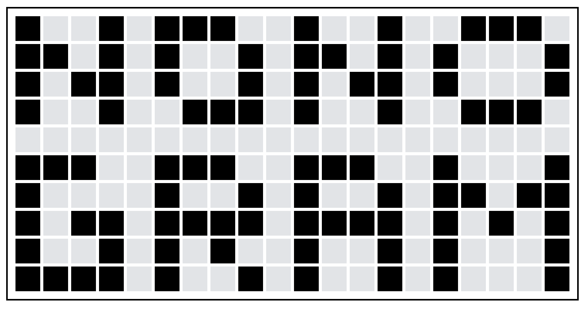

 

<h1 align="center">Nonogram</h1>

A [nonogram](https://en.wikipedia.org/wiki/Nonogram) **_(Chinese name: 数织)_** puzzle game.

## Made by

- [Vue3](https://vuejs.org)
- [Vite](https://vitejs.dev)
- TypeScript
- [UnoCSS](https://github.com/unocss/unocss) with [Iconify](https://iconify.design/)
- [VueUse](https://vueuse.org)

## Deployment

Deployed on Netlify: [https://vue-nonogram.netlify.app](https://vue-nonogram.netlify.app/) or [https://nonogram.thungghuan.xyz](https://nonogram.thungghuan.xyz)
Visit and try a game now!

## How to play

> In this puzzle type, the numbers are a form of discrete tomography that measures how many unbroken lines of filled-in squares there are in any given row or column. For example, a clue of "4 8 3" would mean there are sets of four, eight, and three filled squares, in that order, with at least one blank square between successive sets.
>
> -- from [Wikipedia](https://en.wikipedia.org/wiki/Nonogram)

In my game, left clicking or tapping will toggle the mark type in the order: origin -> fill(check this block) -> cross(ignore this block) -> origin. _*In addition, right clicking will trigger the reverse order.*_

Fill your puzzle and submit it, the page will show whether your result is correct.

🧐 Notice that sometimes it'll have multiple answers for certain puzzle.

You can also set the width and height to generate a new puzzle.

## Generate puzzle from a seed

Every puzzle game will be encoded by [an easy algorithm](src/logic/seed.ts), you can share the generated seed to your friend to solve the same puzzle.

> Try one huh? [http://vue-nonogram.netlify.app/?seed=5x5-dLLYS](http://vue-nonogram.netlify.app/?seed=5x5-dLLYS)

## Customize

Want to create your own puzzle?

Visit the route [`/editor`](http://vue-nonogram.netlify.app/editor), create and share it!
